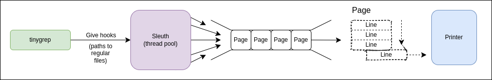

# TINYGREP

## Description

A grep-like utility written in C++ that does a recursive search of a given query in all files in a directory.

## Reasoning

The [Description](#Description) section describes the whole task in general. But if one tries to run the `grep` utility with only two arguments and no options, the `grep` ignores directories:

```
$> grep asdf ..      
grep: ..: Is a directory
```
It is necessary to provide `-r` option to do a recursive "grepping". Also, by default, the `grep` ignores binary files. The tasks enforce the "all files" rule though, which means the option `--binary-files=text` is necessary as well.

In conclusion, TINYGREP mimics the behavior of a
```
grep -r --binary-files=text '<pattern>' '<directory_or_file>'
```

## Tech stack
- C++17
    - std::filesystem - since C++17
    - std::regex - since C++11
    - std::function
    - std::thread
    - std::list
- CMake
- Make
- Linux (Debian-based)

## Design
- [Classes](#Classes)
    - [BaseQueue](#BaseQueue)
    - [Book](#Book)
    - [Page](#Page)
    - [Path](#Path)
    - [Printer](#Printer)
    - [Sleuth](#Sleuth)
    - [TinyGrep](#TinyGrep)
- [Diagram](#Diagram)

## Classes

### TinyGrep
The main class of the program.

### Path
A class containing the directory iterator functionality. Uses the `std::funciton` for callbacks on the discovery of the "regular" files/errors with the directory iteration.

### Printer
A class that has a `std::thread` for printing functionality. Uses the `Book` class as a document to print.

### Sleuth
A class that searches the "hooks" for the "clues", then writes the results to the `Book` class.

### BaseQueue
The thread-safe custom queue implementation is made with the `std::list`. Uses the `std::mutex` with the `std::conditional_variable` to synchronize the queue access between threads using the queue.

### Page

#### Line struct
A structure, which contains the information to print in the `std::string` format and the stream reference to print that `string` to.

#### Page class
A BaseQueue containing `Line` objects. Used by the `Sleuth` class to store the `std::string` results. Can be printed only through the `Book` object.

### Book
A BaseQueue containing `Page` objects. Used by the `Sleuth` class to store the `Page`s with the results.

## Diagram


## Features
- Uses std::filesystem to recursively iterate through directories
- Uses the Basic regex with std::regex
- Thread pool (Sleuth)

## How to run

### Create a build directory
```
mkdir Release
cd Release
```

### Run cmake and build the program
```
cmake -DCMAKE_BUILD_TYPE=Release ..
make
```

### Run the program
```
./tinygrep <pattern> <directory_or_file>
```

## Run tests
It's only natural to test the project against the real `grep` utility, specifically against: `grep -r --binary-files=text` sh cmd.

Run the tests:
```
./test.sh
```

